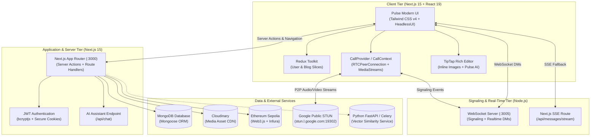
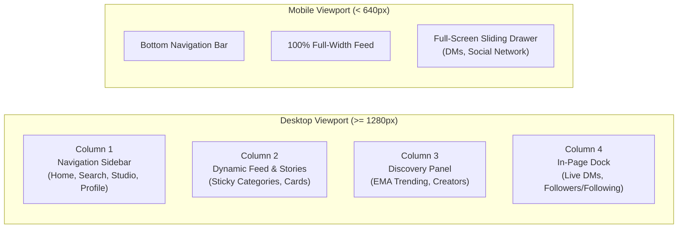
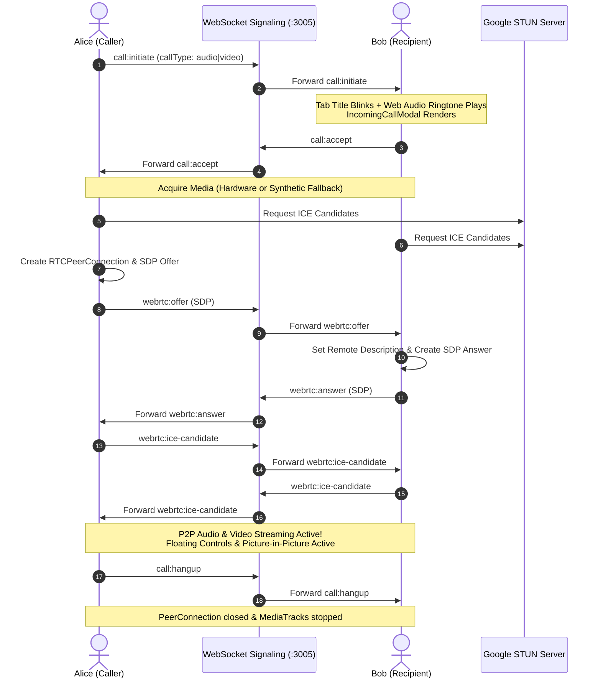
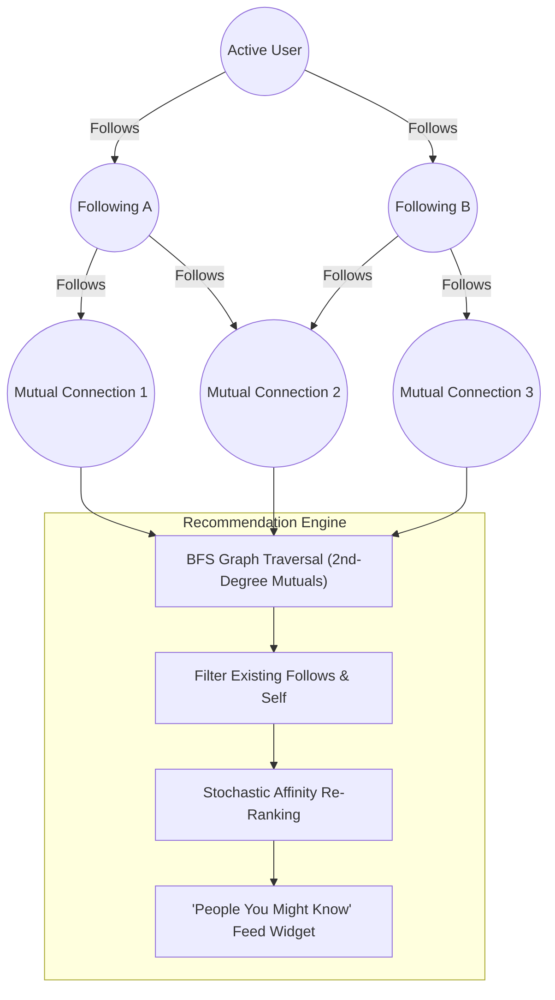
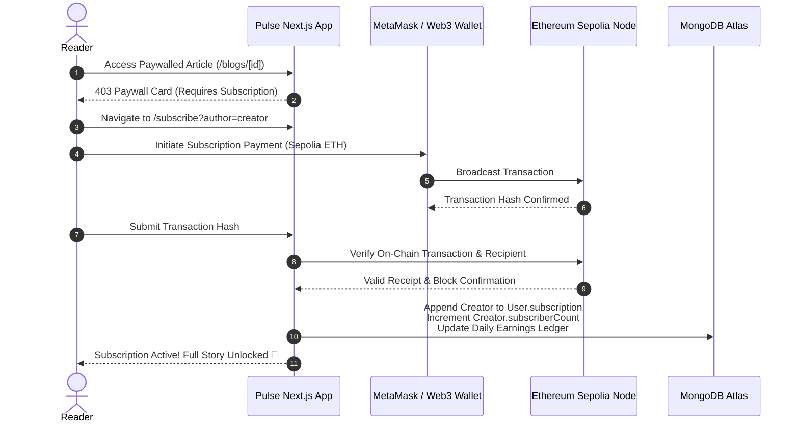

# Pulse — Social Content & Creator Network

<div align="center">

<h3>🌐 Live Production: <a href="https://onlypain.in">onlypain.in</a></h3>

**A modern, decentralized social content network uniting rich storytelling, Web3 creator monetization, graph-powered recommendations, direct messaging, and native WebRTC audio & video live-calling.**

[](https://onlypain.in)
[](https://nextjs.org/)
[](https://react.dev/)
[](https://webrtc.org/)
[](https://developer.mozilla.org/en-US/docs/Web/API/WebSocket)
[](https://www.mongodb.com/)
[](https://ethereum.org/)
[](https://tailwindcss.com/)

[🌐 Visit onlypain.in](https://onlypain.in) • [Explore Platform](#-key-features) • [Legacy vs. Pulse](#-the-pulse-evolution) • [System Architecture](#-system-architecture) • [Live Calling](#-webrtc-live-calling-engine) • [Social Graph](#-social-graph--recommendation-engine) • [Getting Started](#-getting-started)

</div>

---

## 🌟 Overview

**Pulse** redefines the modern publishing and creator ecosystem. Transcending traditional static blogging, Pulse delivers an integrated, real-time social dashboard pairing high-velocity creator publishing with peer-to-peer audio/video calling, sub-20ms direct messaging, crypto-native subscriptions, and graph-based network discovery.

Built on Next.js 15, React 19, MongoDB, and modern WebRTC/WebSocket standards, Pulse features a signature **"Petrichor & Mist"** design aesthetic—a tranquil, high-contrast dark-glass interface with smooth micro-animations and zero intrusive modals.

---

## 🔄 The Pulse Evolution

Pulse is a complete ground-up architectural renovation of the legacy BlogApp:

| Capability | Legacy BlogApp | Newly Renovated Pulse 2.0 |
| :--- | :--- | :--- |
| **Desktop Layout** | Single-column centered blog list | **Responsive 4-Column Social Dashboard** (Nav, Feed, Trending, In-Page DMs/Network) |
| **Direct Messaging** | Not available | **Sub-20ms WebSocket DMs** with SSE fallback, unread counters, and docked panel |
| **Live Calling** | Not available | **Native WebRTC Audio & Video Calling** with screen sharing, PiP, and floating mini-pill |
| **Social Graph** | Isolated reader experience | **Follow/Following Network** + 2nd-degree mutual graph traversal (**"People You Might Know"**) |
| **Content Editor** | Basic text input | **TipTap WYSIWYG Block Editor** + inline image upload/drag-and-drop + **Pulse AI Assistant** |
| **Monetization** | None | **Web3 Sepolia Ethereum Subscriptions** with on-chain verification and creator earnings ledger |
| **Feed Discovery** | Static chronological list | **EMA Time-Decayed Trending Topics**, multi-field case-insensitive tags, and sticky category bar |
| **Public Profiles** | Plain author name | **Dynamic Profiles (`/profile/[user]`)** with cover banner, bio, tabs, in-page DMs, and 1-click calls |
| **Mobile Experience** | Compressed desktop view | **Edge-to-edge native sliding drawers** and touch-optimized responsive typography |

---

## 🚀 Key Features

### 1. 📞 Native WebRTC Live Calling (Audio & Video)
- **100% Zero Paid SDKs**: Pure browser-native `RTCPeerConnection`, `getUserMedia`, and public Google STUN servers.
- **WebSocket Signaling Engine**: Custom low-latency signaling server handling invitations, SDP offers/answers, and ICE candidate trickling.
- **Dark-Glass Calling Window**:
  - Remote video display with picture-in-picture (PiP) local camera stream preview.
  - Animated concentric pulsing rings and audio equalizer visualizer for voice calls.
  - Floating controls pill: Mute mic, Camera toggle, Screen share (`getDisplayMedia`), Minimize, and End call.
- **Floating Minimized Call Widget**: Collapses active calls into a sleek floating widget at the bottom-right (`fixed bottom-6 right-6 z-[9999]`), enabling uninterrupted feed reading while talking.
- **Hardware-Agnostic Synthetic Stream Fallback**: Automatically provides synthetic canvas video and audio tracks if physical hardware is unavailable or in automated test environments.
- **Dual-Notification & Flashing Title**: Dynamic browser tab title blinking (`📞 Incoming Call from @...`) and Web Audio API synthesized ringtones without external audio files.

### 2. 💬 Real-Time Direct Messaging (DMs)
- **Sub-20ms Message Delivery**: Standalone WebSocket server on port `3005` with automatic Next.js Server-Sent Events (SSE) fallback.
- **In-Page 4th Column Layout**: On desktop (`xl+`), messaging docks directly as a dedicated 4th column beside Trending Topics and Featured Creators—zero intrusive backdrop blur or screen dimming.
- **Full-Screen Mobile Drawer**: On mobile screens (`< sm`), DMs expand into a 100% edge-to-edge native sliding window.
- **Intelligent Conversation Sorting**: Unread messages and recent conversations bubble to the top; one-click contact initiation with any follower or following.

### 3. 🎨 Creator Studio & TipTap Block Editor
- **Rich Prose & Media**: TipTap WYSIWYG editor supporting typography hierarchy, hyperlinks, code formatting, and inline image uploads with drag-and-drop / clipboard paste.
- **Pulse AI Writing Assistant**: Integrated streaming endpoint (`/api/chat`) for Title Suggestions, Auto-Summarization, and Prose Enhancement.
- **Real-Time Earnings Analytics**: Daily historical revenue ledger and interactive Chart.js visualizations for creator subscription payouts.

### 4. ⚡ Web3 Sepolia Ethereum Monetization
- **Paywalled Exclusives**: Creators can gate premium content behind lifetime subscription passes.
- **On-Chain Transactions**: Direct reader-to-creator Sepolia ETH smart payments.
- **Automated Verification Daemon**: Background worker monitors pending transactions with Web3.js and Infura, instantly unlocking subscriber access upon block confirmation.

### 5. 🧠 Hybrid Recommendation & Social Graph
- **"People You Might Know"**: Graph BFS/DFS algorithm traversing 2nd-degree mutual connections with stochastic re-ranking to prevent repetitive suggestions.
- **Trending Topics Algorithm**: Exponential Moving Average (EMA) computed across time-decayed view logs to highlight viral stories.
- **Vector Semantic Search**: Optional Python FastAPI microservice providing cosine similarity embedding recommendations.

### 6. 👤 Comprehensive Public Profiles (`/profile/[username]`)
- Dynamic profiles featuring cover headers, bio, subscriber metrics, and custom Cloudinary avatars.
- Interactive in-page tabs for **Stories**, **Followers**, **Following**, and **Direct Messages**.
- Universal quick action buttons: One-click Follow, Direct Message, Voice Call, and Video Call.

---

## 🏗️ System Architecture



---

## 📐 4-Column Responsive Layout Architecture

Pulse features a responsive layout that maximizes viewport efficiency across desktop and mobile form factors:



- **Desktop (`xl+`)**: All 4 columns render side-by-side. Opening DMs or Network lists occupies Column 4 without covering or dimming the feed.
- **Mobile (`< sm`)**: Seamlessly adapts into touch-friendly bottom navigation and an edge-to-edge sliding drawer.

---

## 📡 WebRTC Live-Calling Engine

Pulse implements a resilient, peer-to-peer WebRTC state machine that works out of the box across all modern desktop and mobile browsers.



---

## 🧠 Social Graph & Recommendation Engine

Pulse connects creators through graph-based discovery and time-decayed interest ranking:



### Exponential Time-Decay Formula for Trending Topics
Activity in social networks decays exponentially over time. For an article published at $t_b$, its time-decay weight $w(t_b)$ at $t_{\text{now}}$ is:

$$w(t_b) = e^{-\lambda \cdot \Delta t}, \quad \text{where } \lambda = \frac{\ln(2)}{T_{1/2}} \quad (T_{1/2} = 7 \text{ days})$$

For each tag $T$:
$$\text{Score}(T) = \sum_{b \in \text{Blogs with } T} \left( 1.0 + \sum_{v \in b.\text{viewsLog}} e^{-\lambda \cdot \Delta t_v} \right) \cdot e^{-\lambda \cdot \Delta t_b}$$

---

## ⚡ Web3 Sepolia Monetization Flow

Pulse empowers creators to monetize exclusive content directly through Ethereum smart transactions:



---

## 📂 Project Structure

```
Blog-App/
├── docs/
│   └── development_docs.md         # Comprehensive architectural & implementation docs
├── public/
│   └── upload/thumbnail/           # Local fallback storage
├── recommmender4/                  # Optional Python vector recommendation microservice
│   ├── app/
│   ├── celery_app.py
│   └── requirements.txt
├── src/
│   ├── action/                     # Next.js Server Actions (Database & Business Logic)
│   │   ├── blogAction.js           # Story publishing, editing, likes & comments
│   │   ├── index.js                # Auth, registration & session validation
│   │   ├── messageAction.js        # Direct messages, threads & contact prioritization
│   │   ├── subscriptionAction.js   # Web3 Sepolia payment recording & verification
│   │   └── userAction.js           # Profiles, follow graph & photo uploads
│   ├── app/                        # Next.js App Router (23 routes)
│   │   ├── api/
│   │   │   ├── chat/               # Streaming Pulse AI content assistance
│   │   │   └── messages/stream/    # Native Server-Sent Events (SSE) fallback
│   │   ├── authenticate/           # Sign-in & Sign-up flows
│   │   ├── become-creator/         # Creator onboarding & wallet setup
│   │   ├── blogs/[blog-id]/        # Reading view with paywall & audio narrator
│   │   ├── creator-dashboard/      # Analytics, story management & earnings
│   │   ├── messages/               # Dedicated direct messages view
│   │   ├── profile/[username]/     # Dynamic public profiles with in-page tabs
│   │   ├── search/                 # Semantic & keyword story and user search
│   │   ├── settings/               # Account credentials & preferences
│   │   └── subscribe/              # Ethereum Sepolia creator subscription portal
│   ├── components/
│   │   ├── blog-feed/              # Sticky category bar, 4-column feed & cards
│   │   ├── common-layout/          # Top layout wrapper with Redux & CallProvider
│   │   ├── editor/                 # TipTap WYSIWYG editor with image tools
│   │   ├── live-call/              # WebRTC Calling UI
│   │   │   ├── ActiveCallModal.js  # Full window, PiP video & floating pill widget
│   │   │   └── IncomingCallModal.js# Dual top-toast + center ringing card
│   │   ├── navbar/                 # Search trigger, navigation & unread counters
│   │   └── social-panel/           # In-page 4th column for DMs & network connections
│   ├── context/
│   │   └── CallContext.js          # WebRTC state machine, signaling & audio synth
│   ├── database/                   # MongoDB connection singleton
│   ├── hooks/
│   │   └── useRealtimeMessages.js  # Real-time WebSocket hook with SSE fallback
│   ├── lib/
│   │   ├── realtimeBroadcaster.js  # Dual broadcaster dispatching to WS & SSE
│   │   └── socketServer.js         # Standalone WebSocket server (:3005)
│   ├── models/                     # Mongoose Schemas (User4, Blog4, Message4, Conversation4)
│   ├── provider/                   # Redux Provider & global CallProvider mount
│   └── store/                      # Redux Toolkit store & slices
├── package.json
└── README.md
```

---

## 🛠️ Getting Started

### Prerequisites
- **Node.js**: `v18.0.0` or higher
- **npm** or **yarn**
- **MongoDB**: Local instance or MongoDB Atlas connection URI
- **Infura API Key** (optional, for Sepolia Ethereum transactions)
- **Cloudinary Account** (optional, for cloud-hosted media)

### 1. Installation

```bash
# Clone the repository
git clone https://github.com/Saptarshie/Blog-App.git
cd Blog-App

# Install dependencies
npm install
```

### 2. Environment Configuration

Create a `.env` or `.env.local` file in the project root:

```env
# Database
MONGODB_URL=mongodb+srv://<username>:<password>@cluster.mongodb.net/blogapp?retryWrites=true&w=majority

# Authentication
JWT_SECRET=your_super_secret_jwt_key_here

# Web3 & Sepolia Network
INFURA_ID=your_infura_project_id
NEXT_PUBLIC_INFURA_ID=your_infura_project_id

# Cloudinary Media Storage (Optional)
CLOUDINARY_CLOUD_NAME=your_cloud_name
CLOUDINARY_API_KEY=your_api_key
CLOUDINARY_API_SECRET=your_api_secret

# AI Content Generation (Optional)
OPENAI_API_KEY=your_openai_api_key

# Real-Time WebSocket Port
WS_PORT=3005
```

### 3. Running Locally

Pulse uses a high-performance standalone WebSocket server for real-time messaging and WebRTC signaling alongside the Next.js server.

```bash
# Terminal 1: Launch WebSocket Signaling Server (Port 3005)
node src/lib/socketServer.js

# Terminal 2: Launch Next.js Development Server (Port 3000)
npm run dev
```

Visit **`http://localhost:3000`** in your browser.

---

## ⚡ Real-Time Signaling & Sockets Protocol

The WebSocket server (`src/lib/socketServer.js`) operates on port `3005` and provides bidirectional event streaming:

| Message Type | Direction | Payload Description |
| :--- | :--- | :--- |
| `auth` | Client → Server | Authenticates connection: `{ type: "auth", username }` |
| `ping` / `pong` | Bidirectional | Heartbeat keep-alive to terminate dead connections |
| `call:initiate` | Caller → Recipient | Initiates call: `{ recipient, callType, caller: { username, name, profilePic } }` |
| `call:accept` | Recipient → Caller | Confirms call acceptance and triggers SDP offer generation |
| `call:reject` | Recipient → Caller | Declines call or notifies busy status (`reason: "busy"`) |
| `call:unavailable` | Server → Caller | Notifies caller if recipient has no active sockets online |
| `call:hangup` | Either Peer → Other | Cleanly terminates peer connection and media streams |
| `webrtc:offer` | Caller → Recipient | Exchanges WebRTC SDP offer |
| `webrtc:answer` | Recipient → Caller | Exchanges WebRTC SDP answer |
| `webrtc:ice-candidate` | Peer ↔ Peer | Trickles interactive connectivity establishment (ICE) candidates |
| `new_message` | Server → Client | Pushes newly received direct message to active thread |

---

## 🧪 Production Build & Validation

```bash
# Run production Next.js build
npm run build

# Start optimized production server
npm run start
```

All 23 application routes compile with static generation and dynamic server-rendering optimization.

---

## 🤝 Contributing

Contributions to Pulse are warmly welcomed! Please open an issue to discuss proposed features or submit a pull request with unit tests and clear documentation.

---

<div align="center">

Made with passion for creators, storytellers, and builders worldwide. 💜

</div>