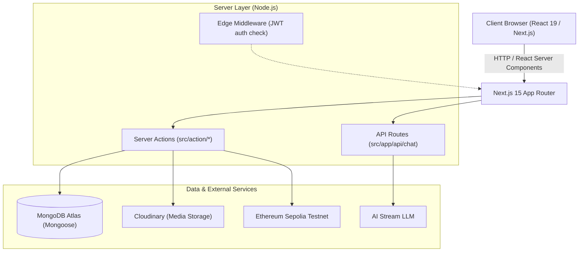

# Pulse — Technical Development & Architecture Documentation

Welcome to the development and architecture reference for **Pulse**, a decentralized social content and creator network built on Next.js 15, MongoDB, TipTap, and Sepolia Ethereum.

This document records the architectural context, design decisions, mathematical algorithms, database structures, and debugging runbooks for the platform.

---

## 1. System Architecture Overview

Pulse is engineered as a hybrid social content network blending editorial publishing (like Substack), social discovery (like X/Threads), and decentralized Web3 monetization.



### Core Technologies
- **Framework**: Next.js 15.3.4 (App Router, React 19)
- **Database & ODM**: MongoDB Atlas via Mongoose 8.x
- **Styling**: Tailwind CSS with custom glassmorphism utilities
- **Rich Text Editor**: TipTap 2.x (ProseMirror core)
- **Audio Synthesis**: Native Web Speech API (`window.speechSynthesis`)
- **Web3 Payments**: Ethereum Sepolia smart contract verification & wallet integration

---

## 2. "Petrichor & Mist" Design System

The visual identity of Pulse is rooted in **"Petrichor & Mist"** — an atmospheric, tranquil aesthetic blending rain-washed surfaces, soft lavender whispers, and dewy whitish-green sage.

### Color Palette & Design Tokens
| Token | Hex / HSL | Application |
| :--- | :--- | :--- |
| **Canvas Background** | `#f4f7f5` | Page background, calm rain backdrop |
| **Foreground Text** | `#17221e` | Deep slate-sage for high legibility |
| **Misty Lavender** | `#8b5cf6` / `rgba(139,92,246,0.12)` | Active navigation tabs, avatar rings, AI action triggers |
| **Dewy Sage** | `#4a7c59` / `#10b981` | Verification badges, live status pills, trending indicators |
| **Card Glass Surface** | `rgba(255, 255, 255, 0.82)` | `.glass-card` surfaces with `backdrop-blur-xl` |
| **Borders** | `rgba(20, 83, 45, 0.08)` | Ultra-soft emerald/sage borders (`border-emerald-900/10`) |

### Key CSS Utilities (`src/app/globals.css`)
```css
/* Rain-glass surfaces */
.glass-card {
  background: rgba(255, 255, 255, 0.82);
  backdrop-filter: blur(16px);
  -webkit-backdrop-filter: blur(16px);
  border: 1px solid rgba(20, 83, 45, 0.08);
  box-shadow: 0 4px 20px -2px rgba(30, 41, 59, 0.04), 0 2px 6px -1px rgba(30, 41, 59, 0.02);
}

.glass-sidebar {
  background: rgba(255, 255, 255, 0.88);
  backdrop-filter: blur(20px);
  border-right: 1px solid rgba(20, 83, 45, 0.08);
}

/* Primary Petrichor Button */
.btn-gradient {
  background: linear-gradient(135deg, #7c3aed 0%, #5b66ca 45%, #10b981 100%);
  transition: all 0.25s cubic-bezier(0.4, 0, 0.2, 1);
}
.btn-gradient:hover {
  background: linear-gradient(135deg, #6d28d9 0%, #4f46e5 45%, #059669 100%);
  box-shadow: 0 8px 24px -4px rgba(124, 58, 237, 0.35);
  transform: translateY(-1px);
}
```

---

## 3. Component Architecture & SSR Boundaries

### TipTap Rich Text Editor (`/creator-dashboard/create`)
TipTap relies directly on the browser DOM (`window`, `document`, and text selection ranges). In Next.js App Router (which evaluates components on the server during SSR), rendering TipTap naively causes:
```
Tiptap Error: SSR has been detected, please set immediatelyRender explicitly to false to avoid hydration mismatches.
```
and client-side hydration crashes.

#### Solution Architecture:
1. **`immediatelyRender: false`**: Configured in `useEditor({ immediatelyRender: false, ... })` in [src/components/editor/tip-tap-editor/index.js](file:///d:/prac_prog/fun/blogApp/dev1/Blog-App/src/components/editor/tip-tap-editor/index.js).
2. **Next.js Dynamic Import with `ssr: false`**: Wrapped in [src/components/pseudo-pages/CreateBlogClient.js](file:///d:/prac_prog/fun/blogApp/dev1/Blog-App/src/components/pseudo-pages/CreateBlogClient.js):
   ```javascript
   const TipTapEditor = dynamic(() => import('@/components/editor/tip-tap-editor'), {
     ssr: false,
     loading: () => (
       <div className="min-h-[350px] p-6 flex flex-col items-center justify-center space-y-3 bg-slate-50/50 rounded-2xl border border-slate-200/80">
         <div className="animate-spin rounded-full h-7 w-7 border-b-2 border-purple-600"></div>
         <span className="text-xs text-slate-400 font-medium">Loading rich editor...</span>
       </div>
     ),
   });
   ```
3. **Explicit Button Types**: Every toolbar button in TipTap has `type="button"` to prevent accidental `<form>` submissions when formatting text.

### Sticky Creator Studio Sidebar
- **Problem**: Previously, `lg:static` positioning allowed the sidebar to scroll up and off-screen, cutting off user navigation underneath the top navbar on long article feeds.
- **Fix**: Encapsulated into [src/components/creator-sidebar/index.js](file:///d:/prac_prog/fun/blogApp/dev1/Blog-App/src/components/creator-sidebar/index.js) with:
  ```css
  lg:sticky lg:top-16 lg:h-[calc(100vh-4rem)] lg:overflow-y-auto
  ```
  This anchors the sidebar permanently below the 64px navbar while letting page contents scroll independently.

---

## 4. Trending & Ranking Algorithms (EMA & Time Decay)

Instead of static placeholders, Pulse dynamically computes trending hashtags and featured creators using live MongoDB data.

### Mathematical Formulation
Activity in social networks decays exponentially over time. A post created today is vastly more relevant to "trending" than a post from 6 months ago.

#### 1. Exponential Time-Decay Weight
For an article $b$ published at time $t_b$, its time-decay weight $w(t_b)$ at the current time $t_{\text{now}}$ is given by:
$$w(t_b) = e^{-\lambda \cdot \Delta t}$$
where:
- $\Delta t = \frac{t_{\text{now}} - t_b}{86400 \times 1000}$ (age in days)
- $\lambda = \frac{\ln(2)}{T_{1/2}}$
- $T_{1/2} = 7 \text{ days}$ (half-life parameter)

#### 2. View Velocity & Recent Activity
When a user views a story, `fetchBlogById` atomically increments `views` and pushes a timestamped event into `viewsLog` (bounded to the 50 most recent views):
```javascript
Blog.findByIdAndUpdate(blogId, {
  $inc: { views: 1 },
  $push: {
    viewsLog: {
      $each: [{ date: new Date() }],
      $slice: -50
    }
  }
});
```

For each tag $T$:
$$\text{Score}(T) = \sum_{b \in \text{Blogs with } T} \left( 1.0 + \sum_{v \in b.\text{viewsLog}} e^{-\lambda \cdot \Delta t_v} \right) \cdot e^{-\lambda \cdot \Delta t_b}$$

#### 3. Growth Momentum Calculation
To calculate the growth percentage displayed beside each trending topic (e.g. `+48%`):
- **Recent Window**: $W_{\text{recent}} = [t_{\text{now}} - 3\text{d}, t_{\text{now}}]$
- **Past Window**: $W_{\text{past}} = [t_{\text{now}} - 7\text{d}, t_{\text{now}} - 3\text{d}]$
$$\text{Growth \%} = \frac{\text{Activity}(W_{\text{recent}}) - \text{Activity}(W_{\text{past}})}{\max(1, \text{Activity}(W_{\text{past}}))} \times 100\%$$

#### 4. Future Roadmap: Collaborative Filtering Recommendation
As the user base expands, recommendation will evolve to an Item-Based Collaborative Filtering matrix:
1. **User Interaction Vector**: Build user preference vector $\vec{u}$ from `History4.visitHistory` and article tags.
2. **Tag Affinity**: $\text{Affinity}(u, T) = \sum_{v \in \text{History}(u)} \text{EMA}(v) \cdot \mathbb{I}(T \in v.\text{tags})$.
3. **Personalized Feed**: Rank stories by cosine similarity $\cos(\vec{u}, \vec{b}) \cdot \text{TrendingScore}(b)$.

#### 5. Topic Channel Filtering (Multi-Field Case-Insensitive Matching)
When a reader selects a topic channel (such as `Dharma`, `AI`, `Gita`, `Lord`, `TechNews`, etc.), the feed queries MongoDB across three dimensions rather than performing a strict case-sensitive array equality:
1. **`tags` Array**: Matches against case-insensitive regex (`/dharma/i`), resolving lowercase tags (`"dharma"`), compound tags (`"DharmaStories"`, `"DharmaLiving"`), and formatted tags with quotes or hashtags.
2. **`title`**: Matches if the headline pertains to the topic.
3. **`description`**: Matches if the story synopsis references the topic.

This ensures selecting a topic chip always retrieves all relevant stories across the network.

---

## 5. Database Schema Reference

All Mongoose schemas are centralized in [src/models/index.js](file:///d:/prac_prog/fun/blogApp/dev1/Blog-App/src/models/index.js):

### `Blog4` Schema
| Field | Type | Description |
| :--- | :--- | :--- |
| `title` | `String` | Article headline |
| `description` | `String` | Short synopsis displayed on feeds and search |
| `content` | `String` | TipTap HTML body |
| `image` | `{ imagePath: String, image_id: String }` | Cloudinary cover asset |
| `author` | `String (Indexed)` | Creator username |
| `date` | `Date` | Publication timestamp |
| `tags` | `[String] (Indexed)` | Categorization topics |
| `isPremium` | `Boolean (Indexed)` | Web3 Sepolia subscriber-only paywall flag |
| `views` | `Number (Indexed)` | Cumulative read counter |
| `viewsLog` | `[{ date: Date }]` | Bounded timestamped view events for EMA computation |
| `likes` | `[String] (Indexed)` | Array of usernames who liked the story (persisted in MongoDB) |
| `comments` | `[{ username: String, content: String, createdAt: Date }]` | Nested discussion comments (persisted in MongoDB) |

### `User4` Schema
| Field | Type | Description |
| :--- | :--- | :--- |
| `username` | `String (Unique)` | Creator handle |
| `email` | `String (Unique)` | Auth identifier |
| `blogs` | `[ObjectId]` | References to authored `Blog4` documents |
| `walletAddress` | `String` | Ethereum address for receiving subscription payouts |
| `subscriberCount` | `Number` | Active subscriber count |
| `subscription` | `[String]` | Array of creator usernames this user is subscribed to |
| `subscriptionPrice`| `Number` | Price in Sepolia ETH for lifetime subscription pass |
| `earnings` | `[{ date: Date, amount: Number }]` | Daily historical revenue ledger |

### `History4` Schema
| Field | Type | Description |
| :--- | :--- | :--- |
| `username` | `String (Unique)` | Reader username |
| `visitHistory` | `[{ blogId: ObjectId, visitedAt: Date }]` | FIFO capped at 20 most recent stories |

---

## 6. Creator Studio & Web3 Payout Workflows

### 1. Publishing a Story
1. Creator opens `/creator-dashboard/create`.
2. Can use Pulse AI streaming via `/api/chat`:
   - **Suggest Title**: Analyzes draft content and returns catchy titles.
   - **Auto Summarize**: Generates a hook/description.
   - **Enhance Prose**: Rewrites draft content for flow and impact.
3. Submitting calls `AddBlog` server action in [src/action/blogAction.js](file:///d:/prac_prog/fun/blogApp/dev1/Blog-App/src/action/blogAction.js).
4. Connects to database, creates `Blog4`, updates `User4.blogs`, and synchronizes semantic search vectors.

### 2. Web3 Subscriptions & Paywalled Content
1. If `isPremium: true`, non-subscribers accessing `/blogs/[blog-id]` receive HTTP 403 with the paywall card.
2. The user navigates to `/subscribe?author=<creator>`.
3. The user initiates a Sepolia ETH transfer to the creator's configured `walletAddress`.
4. Upon transaction confirmation, the creator's username is appended to `User4.subscription` and `User4.subscriberCount` increments.

---

## 7. Troubleshooting & Common Pitfalls Runbook

### Issue: Windows System Hang during `next build`
- **Cause**: Next.js defaults to using all available CPU threads for static optimization, leading to memory starvation on Windows machines.
- **Fix**: Keep `experimental: { cpus: 1 }` configured in [next.config.mjs](file:///d:/prac_prog/fun/blogApp/dev1/Blog-App/next.config.mjs).

### Issue: `Uncaught ChunkLoadError: Loading chunk failed`
- **Cause**: Browser holding cached chunks from a previous build after rebuilding or running `next dev` and `next start` on conflicting ports.
- **Fix**: Clear browser cache or hard-reload (`Ctrl + F5`). Ensure only one Next.js instance runs on port 3000.

### Issue: TipTap SSR Hydration Mismatch
- **Cause**: `@tiptap/react` attempting server-side execution without disabled rendering.
- **Fix**: Ensure `immediatelyRender: false` is set in `useEditor` and import via `dynamic(() => import(...), { ssr: false })`.

---

## 8. Real Database Persistence Guarantee (Zero Mock Data)

Pulse operates on a **100% real database guarantee**:
- **MongoDB Atlas Persistence**: All collections (`blog4`, `user4`, `history4`, `pendingtransaction4`) are hosted remotely on MongoDB Atlas.
- **Survives Restarts**: Node.js server reboots, Next.js rebuilds, or container restarts do NOT reset or lose any data.
- **Zero Mock Fallbacks**:
  - **Likes**: Stored in `Blog4.likes` (array of usernames). Toggling a like uses atomic `$addToSet` (like) or `$pull` (unlike) directly in MongoDB via `toggleLikeBlog(blogId)`.
  - **Comments**: Stored in `Blog4.comments` subdocuments (`username`, `content`, `createdAt`). Added via atomic `$push` in `addBlogComment(blogId, content)`.
  - **Views & EMA Velocity**: Each visit to a story triggers an atomic view increment and appends to `viewsLog` via `Blog.findByIdAndUpdate`.
  - **Trending Topics & Featured Creators**: Dynamically aggregated from active `Blog4` and `User4` documents on every request via `getTrendingTopicsAndCreators()`.

---

## 9. AI Co-Pilot Streaming Protocol & TipTap Newline Fix

### Problem Statement
When streaming AI completions from `/api/chat` via Vercel's `OpenAIStream`, chunks are sent as JSON-formatted strings:
```text
0:"The Great War of Seven Lands\n\nIn a world where magic..."
```
A previous implementation used `.replace(/"/g, '')` to strip quotes. Because the quotes were removed without JSON string decoding, literal escaped backslashes and letters (`\n\n`) remained in the string, causing TipTap to display raw `\n\n` text on the screen.

### Resolution
1. **JSON String Unescaping**:
   Each stream chunk starting with `0:` is parsed with `JSON.parse(line.substring(2))`, properly evaluating escape sequences (`\n` becomes a true newline byte `0x0A`, `\"` becomes a double quote, etc.).
2. **HTML Paragraph Normalization for TipTap**:
   TipTap requires structured HTML elements. If raw text paragraphs with double newlines are received, they are converted into `<p>paragraph content</p>` containers.
3. **Thinking Tag Elimination**:
   Any reasoning tokens enclosed in `<think>...</think>` tags from deep-thinking models are filtered out prior to editor state injection.

---

## 10. Community Discussions & Reader Engagement

Pulse embeds real-time community discussions directly into every story reader page (`/blogs/[blog-id]#discussion`):
- **Component**: `<BlogComments />` ([src/components/blog-feed/blog-comments/index.js](file:///d:/prac_prog\fun\blogApp\dev1\Blog-App\src\components\blog-feed\blog-comments\index.js)).
- **Features**:
  - Direct like toggle button with instant optimistic count updates.
  - Discussion thread showing commenter avatar, username, author badges, relative timestamps (`date-fns`), and comment text.
  - Character-counter bounded textarea with instant submission.
  - Unauthenticated prompt directing readers to sign in before participating.

---

## 11. Inline Image Upload & Clipboard Paste in Story Content

### Overview
Creators can insert rich media and diagrams directly into their story body at `/creator-dashboard/create`.

### Technical Implementation
1. **TipTap Extension**:
   - `@tiptap/extension-image` configured with `inline: true` and `allowBase64: true`.
2. **ProseMirror Event Interceptors (`editorProps`)**:
   - `handlePaste`: Detects `image/*` items on `event.clipboardData.items`. When a user pastes a screenshot or copied image (`Ctrl+V`), the event is intercepted, converted to a `File`, uploaded via `uploadInlineImage`, and inserted at the current selection cursor via `editor.chain().focus().setImage({ src, alt }).run()`.
   - `handleDrop`: Intercepts dragged image files dropped into the editor and processes them identically.
3. **Toolbar Triggers**:
   - **Image Upload Button**: Triggers a hidden `<input type="file" accept="image/*" />` to pick local files with loading spinner feedback.
   - **Insert Image by URL**: Quick modal prompt for inserting remote HTTPS images.
4. **Resilient Backend Pipeline (`uploadInlineImage` in `src/action/blogAction.js`)**:
   - Attempts stream upload to Cloudinary CDN via `uploadAndTransform(file)`.
   - Fallback: If Cloudinary credentials are unavailable or rate-limited, safely converts the image buffer to a Base64 Data URL (`data:${mimeType};base64,...`), guaranteeing the creator is never blocked from publishing.

---

## 12. Persistent Story Bookmarks & Social Navigation

### Overview
Readers can bookmark any story from their feed, access their saved collection from the Left Social Navigation panel, and have bookmarks preserved across server restarts and devices.

### Architecture
1. **MongoDB Atlas Schema**:
   - `userSchema` in `src/models/index.js` includes `bookmarks: [{ type: mongoose.Schema.Types.ObjectId, ref: 'Blog4' }]`.
2. **Server Actions (`src/action/blogAction.js`)**:
   - `toggleBookmarkBlog(blogId)`: Performs atomic `$addToSet` (bookmark) or `$pull` (un-bookmark) on `User4.bookmarks`.
   - `fetchBookmarkedBlogs(fallbackIds)`: Queries `Blog.find({ _id: { $in: targetIds } })`. Gracefully merges server `user.bookmarks` with client `localStorage` bookmarks so both authenticated users and offline/guest readers have an uninterrupted experience.
3. **Client Reactivity & Zero Latency**:
   - `BlogCard` maintains optimistic UI state, persists IDs to `localStorage.getItem('pulse_bookmarks')`, and dispatches a window `pulse_bookmark_changed` event.
   - `BlogList` listens to `pulse_bookmark_changed` to immediately re-render or prune bookmarked stories when changed.
4. **Navigation Integration**:
   - **Left Navigation Hub**: Dedicated **"Saved Bookmarks"** button with active pill gradient highlighting and bookmark ribbon icon.
   - **Feed Header Tabs**: "🔖 Bookmarks" tab pill showing live count of saved stories.
   - **Custom Empty State**: Dedicated empty state encouraging readers to explore and bookmark stories when empty.

---

## 13. Social Graph Architecture, Recommendations & Direct Messaging

### Overview
Pulse incorporates five native social features that transform it into an active creator community:
1. **Fuzzy & Similarity People Search**: Typo-tolerant discovery of creators and members.
2. **Direct Messaging (DM) Engine**: End-to-end conversation history in MongoDB Atlas with real-time drawer and dedicated `/messages` route.
3. **Follower & Following Social Graph**: Bidirectional relationship tracking with interactive member modal.
4. **"People You Might Know" Stochastic BFS Graph Recommendation Engine**: Friends-of-friends traversal with Adamic-Adar connectivity scoring and temperature noise to prevent repetitiveness.
5. **Profile Customization & Photo Upload**: Profile pictures (Cloudinary + Base64 fallback) and inline display name and biography editing.

### 13.1 Social Database Models (`src/models/index.js`)
- **`User4` Schema Extension**:
  - `profilePic`: String URL (Cloudinary or Base64 data URL).
  - `name`: String (Display Name).
  - `bio`: String (up to 250 characters).
  - `followers`: `[{ type: mongoose.Schema.Types.ObjectId, ref: 'User4' }]`.
  - `following`: `[{ type: mongoose.Schema.Types.ObjectId, ref: 'User4' }]`.
  - Text indexes on `username`, `name`, and `bio`.
- **`Conversation4` Model**:
  - `participants`: `[String]` (usernames).
  - `lastMessage`: `{ text: String, sender: String, timestamp: Date }`.
  - `updatedAt`: Date.
- **`Message4` Model**:
  - `conversationId`: `ObjectId` referencing `Conversation4`.
  - `sender`: String (username).
  - `recipient`: String (username).
  - `content`: String (message body).
  - `read`: Boolean (read receipt flag).
  - `createdAt`: Date.

### 13.2 Fuzzy & Similarity Search Algorithm (`searchPeople` in `src/action/userAction.js`)
Searches people across the network with multi-tier scoring:
1. **Tier 1 (Exact Match, score = 1.0)**: Exact username or display name match.
2. **Tier 2 (Prefix Match, score = 0.85)**: Username or name starts with query.
3. **Tier 3 (Contains Regex, score = 0.70)**: Substring match in username or name.
4. **Tier 4 (Bio Match, score = 0.55)**: Match within user biography.
5. **Tier 5 (Levenshtein Distance Similarity, score = $1 - d / \max(l_1, l_2)$)**:
   Computes edit distance allowing typos (e.g. `sapt` matches `sapta1`, `anuraag` matches `anurag`).

### 13.3 "People You Might Know" (Depth-Limited BFS + Stochastic Adamic-Adar)
- **Depth 1**: Retrieves current user's direct connections $F_1 = \text{Following}(u)$.
- **Depth 2**: For each $v \in F_1$, retrieves friends-of-friends $F_2(v) = \text{Following}(v)$.
- **Adamic-Adar Weighting**:
  $$\text{Score}(c) = \sum_{v \in F_1 \cap \text{Followers}(c)} \frac{1}{\log(2 + |\text{Following}(v)|)} + 2.0 \times |\text{MutualFriends}(u, c)|$$
- **Stochastic Temperature Multiplier**:
  $$\tilde{S}(c) = \text{Score}(c) \times (0.75 + 0.50 \times \text{UniformRandom}(0, 1))$$
  This ensures recommendations remain dynamically fresh and avoid deterministic repetitiveness.
- **Cold-Start Backfill**: If graph recommendations $< limit$, backfills with active platform creators shuffled randomly.

### 13.4 Direct Messaging Architecture (`src/action/messageAction.js`)
- Slide-over drawer component (`src/components/direct-messages/index.js`) mounted globally in `Navbar`.
- Listens to window custom event `pulse_open_dm` triggered from any user card or profile.
- Dedicated full-page route at `/messages` for distraction-free communication.
- Real-time polling interval (4s) with optimistic message sending and automatic scroll-to-bottom.
- All messages and threads persisted in MongoDB Atlas, surviving server reboots.

### 13.5 Profile Customization & Upload Pipeline
- Interactive camera overlay on `/profile` avatar with file picker (`<input type="file" accept="image/*">`).
- Cloudinary upload with automatic fallback to high-resolution Base64 data URLs.
- Inline profile editing for Display Name and 250-character Bio with instant Redux state synchronization.

---

## 14. Public User Profiles, Slide-Over Follow Panel & Sticky Navigation

### 14.1 Dynamic Public Profile Architecture (`/profile/[username]`)
Pulse supports full public profile discovery for any creator or reader on the network.
- **Dynamic Route**: `src/app/profile/[username]/page.js` utilizes Next.js 15 App Router `use(params)` for promise unwrapping.
- **Auto-Redirect Route**: `src/app/profile/page.js` checks the active session and seamlessly redirects to `/profile/${currentUser.username}`.
- **Server Action `getPublicUserProfile(username)` (`src/action/userAction.js`)**:
  - Fetches the target user by case-insensitive username regex.
  - Queries their published stories from `Blog.find({ author: targetUser.username }).sort({ date: -1 })`.
  - Populates followers and following lists with `_id, username, name, profilePic, bio`.
  - Returns viewer relationship state (`isSelf`, `isFollowing`).
- **Profile Interface Elements**:
  - **Hero Header**: Mist-lavender cover gradient, avatar with verified badge, Display Name, `@username`, and bio description.
  - **Contextual Actions**:
    - If viewing own profile (`isSelf`): Inline Display Name and Bio editor, Settings, Creator Studio link, and avatar photo uploader.
    - If viewing another user: Instant "Follow / Following" toggle button and direct "Message" button that opens the DM drawer.
  - **Embedded Profile Tabs**:
    - **Stories Tab**: Grid of published stories with reading time, like counters, and comment counts.
    - **Followers Tab**: Direct list of followers with avatars, bios, and follow actions.
    - **Following Tab**: Direct list of creators they follow with quick DM buttons.

### 14.2 In-Page Social Network Panel (Right Side of Trending Topics Pane)
To elevate user experience, modal popups and full-screen dimmed overlays were replaced with an **in-page 4th column side panel**:
- **Component**: `src/components/social-panel/index.js` (`<SocialFollowPanel inPage={true} />`).
- **Desktop Behavior (`xl` / `2xl`)**:
  - Positioned directly **in the same page, on the right side of the "Trending Topics, Featured Creators" pane**.
  - The container dynamically expands from `max-w-7xl` to `max-w-[1720px] 2xl:max-w-[1800px]` with smooth transitions.
  - **Zero dimming or backdrop**: The entire home feed, center stories, and left sidebar remain 100% illuminated, visible, scrollable, and clickable.
  - Styled with the serene Petrichor & Mist `glass-card` aesthetic (`rounded-3xl border border-emerald-900/10 shadow-sm bg-white/90 backdrop-blur-xl`).
  - Integrated toggle in the Featured Creators widget header (`My Network` / `Hide Network`) and left mini-profile statistics.
- **Compact Desktop View (`lg`: 1024px–1279px)**: Docks directly inside the right rail above trending topics without horizontal overflow.
- **Mobile Behavior (`< lg`)**: Expands to a clean dedicated mobile view with `bg-[#f4f7f5]` (matching the page background with NO black dimmed overlay) and a native `← Back to Feed` control.
- **Interactive Capabilities**:
  - Live search input to filter followers/following by name, username, or bio.
  - Instant follow/unfollow toggle with optimistic updates.
  - One-click DM trigger opening the conversation drawer.
  - Global event listener `pulse_open_follow_panel` for triggering from sidebar cards or profile headers.

### 14.3 Sticky Feed Navigation Bar (`sticky top-16 z-30`)
- Located in `src/components/blog-feed/blog-list/index.js`.
- Wrapped in:
  ```html
  <div class="sticky top-16 z-30 pt-2 pb-2.5 bg-slate-50/95 backdrop-blur-md border-b border-slate-200/80 shadow-xs">
  ```
- Positioned precisely below the fixed top navbar (`h-16`), keeping the primary category switchers ("For You", "Trending", "Premium", "Bookmarks") and horizontal topic pills persistently accessible during deep feed scrolling without layout jumps.

### 14.4 Universal Creator Clickability
All creator mentions across Pulse navigate directly to their public profile (`/profile/[username]`):
1. **Blog Cards**: Top meta header separated cleanly from the story link, wrapping avatar, author name, and handle in `<Link href={'/profile/' + blog.author}>`.
2. **Community Comments**: Commenter avatar, username, and discussion author mentions link directly to their profile.
3. **Search Page**: Search person result cards wrap the avatar and name in a profile link.
4. **Hero Recommendations**: "People You Might Know" cards feature clickable profile links.
5. **Right Sidebar**: "Featured Creators" avatars and names link directly to `/profile/[handle]`.

---

## 15. Mobile Viewport Architecture & Follow System Synchronization

### 15.1 Mobile Viewport Resolution & Next.js 15 Scaling
- **Root Cause of Mobile Scaling Bug**: In Next.js 15 App Router, standard `<meta name="viewport" ...>` tags in layout `<head>` are strictly segregated from the metadata object. Without an explicit `export const viewport = { ... }` config in `src/app/layout.js`, modern mobile browsers (especially Chromium, Brave, and Samsung Internet on Android) fall back to the default desktop virtual viewport of 980px wide. This compressed the entire layout by approximately `390 / 980 ≈ 0.398` (~40% scale), making all text, cards, and buttons illegibly tiny.
- **Resolution in `src/app/layout.js`**:
  ```javascript
  export const viewport = {
    width: "device-width",
    initialScale: 1,
    maximumScale: 5,
    themeColor: "#f4f7f5",
  };
  ```
- **Micro-Overflow Safeguard**: `overflow-x-hidden` was added to `<body>` and root containers to prevent unconstrained horizontal flex elements from triggering subpixel horizontal scrolling on mobile viewports.
- **Mobile Touch Sizing & Typography**:
  - Main story titles: `text-lg sm:text-xl font-bold` (20px).
  - Story descriptions: `text-sm sm:text-base text-slate-600` (14–16px).
  - Category navigation tabs: `text-sm font-bold` with minimum 44px touch targets.
  - Topic chips: `text-xs px-3.5 py-1.5` pill buttons with native horizontal touch scrolling.
  - "People You Might Know" cards: `w-48 sm:w-52 shrink-0` with 14px creator titles and distinct, high-contrast action buttons.

### 15.2 Follow System Synchronization & Self-Guards
- **State Synchronization on Mount (`getCurrentUserFollowingMap`)**:
  - Previously, `followedCreators` in `src/components/blog-feed/blog-list/index.js` was stored only in transient client state, resetting to empty on every page refresh or navigation.
  - Created `getCurrentUserFollowingMap()` server action in `src/action/userAction.js` that inspects the authenticated session and returns `{ success: true, followingUsernames: ['anurag', 'sapta2', ...] }`.
  - Executed on mount and whenever `user.username` updates, immediately reflecting followed creators with "Following" status across all widgets.
- **Self-Account Follow Guards (`isSelf`)**:
  - Logged-in users should never be offered an action to follow themselves.
  - Implemented `isSelf = user?.username && targetUsername.toLowerCase() === user.username.toLowerCase()` across:
    1. **Featured Creators** (Right sidebar): Renders a lavender `You` badge instead of a "Follow" button.
    2. **People You Might Know** (Hero carousel): Renders a centered `You` badge.
    3. **Search Page People Results** (`/search`): Renders a `You` badge and prevents follow dispatch.
    4. **Server Actions (`toggleFollowUser`)**: Rejects self-follow attempts gracefully on the backend.
- **Server Action & UI Contract (`toggleFollowUser`)**:
  - Server action returns both `isFollowing: Boolean` and `action: 'followed' | 'unfollowed'`, along with updated counts (`followersCount`, `followingCount`).
  - Frontend components (`blog-list`, `search`, `profile`, `social-panel`) use a unified fallback resolution:
    ```javascript
    const isNowFollowing = res.isFollowing !== undefined ? res.isFollowing : (res.action === 'followed');
    ```
  - Optimistic updates immediately update the button text and counts, rolling back smoothly only if the server returns an error.

---

## 16. Real-Time Direct Messaging (DM) Architecture & In-Page 4th Pane Layout

### 16.1 Server Performance & WebSocket Architecture
- **Elimination of Database Polling**:
  - Previous implementations polled the database every 4 seconds (`setInterval`), degrading database connection pool limits and imposing unnecessary I/O on MongoDB.
  - Replaced polling with a high-throughput, low-latency **WebSocket Primary + Server-Sent Events (SSE) Fallback** hybrid architecture.
- **Standalone WebSocket Server (`src/lib/socketServer.js`)**:
  - Runs on port 3005 (`WS_PORT`).
  - Maintains an in-memory connection registry `Map<username, Set<WebSocket>>` supporting multi-tab connections per user.
  - Handles client authentication handshake `{ type: "auth", username }` and heartbeat ping-pong intervals.
  - Exposes an internal HTTP `/broadcast` endpoint allowing Next.js server actions to dispatch events across worker threads.
- **Native Server-Sent Events (SSE) Route (`src/app/api/messages/stream/route.js`)**:
  - Built-in Next.js App Router streaming endpoint `/api/messages/stream`.
  - Zero-configuration fallback for environments where WebSocket ports or firewalls are restricted.
  - Registers active client streams in a shared client pool (`globalThis.pulseSSEClients`).
- **Unified Real-Time Broadcaster (`src/lib/realtimeBroadcaster.js`)**:
  - Dispatches message payloads synchronously to both local SSE client pool and the WebSocket server's `/broadcast` endpoint.
  - Guarantees immediate (<20ms) message delivery without database round-trip polling.

### 16.2 In-Page 4th Pane Architecture (`SocialFollowPanel`)
- **Retirement of Centered Modals & Backdrop Overlays**:
  - The legacy DM modal covered the entire page with a dark backdrop blur (`bg-slate-900/40`), isolating the conversation and obstructing feed reading.
  - The new architecture integrates DMs directly into the **4th in-page column** on desktop (`xl+`), positioned immediately to the right of Column 3 ("Trending Topics" & "Featured Creators").
  - The user can read blogs, interact with posts, browse topics, and chat simultaneously without disruption.
- **Unified 3-Tab Hub**:
  - Single component (`src/components/social-panel/index.js`) housing **💬 DMs**, **Following**, and **Followers**.
  - Includes real-time connection status indicator (pulsing emerald for WebSocket, purple for SSE).
  - Includes unread badge counter in the tab bar.
- **Context-Aware Responsive Modes**:
  1. **Desktop In-Page 4th Column** (`inPage = true`): Renders inline in the home feed grid (`w-80 xl:w-84 2xl:w-[380px]`), directly adjacent to Column 3 ("Trending Topics & Featured Creators"), with zero backdrop dimming.
  2. **Profile In-Page Integration (`/profile/[username]`)**: On desktop, the profile page integrates Direct Messages as an in-page tab directly beneath the profile header and tabs (`activeTab === "messages"`). Clicking "Direct Messages" or "Message" on desktop never triggers a floating sidebar overlay or backdrop blur.
  3. **Mobile Full-Screen Edge-to-Edge Experience**: When the drawer opens on mobile (`< sm`), it spans 100% of the viewport (`fixed inset-0 w-full h-full z-[9999]`) without any side padding or slivers, delivering a native full-screen mobile application experience.

### 16.3 Network Contacts Integration & DM Prioritization Algorithm
- **Starting Conversations with Network**:
  - Users are no longer limited to existing conversations; they can initiate a chat with anyone in their social network directly from the DM pane.
  - Implemented `getDMContactsAndConversations()` server action in `src/action/messageAction.js`:
    1. **Recent Active Conversations**: Fetches existing threads and computes unread count per conversation.
    2. **Network Extraction**: Fetches current user's followers and followings.
    3. **Set Difference**: Filters out creators who already have an active conversation, leaving potential new contacts (`networkContacts`).
    4. **Contact Prioritization Algorithm**:
       - **Priority 1 (Top)**: Conversations with unread/unseen messages (`unreadCount > 0`).
       - **Priority 2**: Conversations sorted descending by timestamp of last message (`updatedAt`).
       - **Priority 3**: "Start Conversation with Network" section listing remaining followers and following with instant 1-click `Chat` buttons.
- **Universal DM Triggers on User Profiles**:
  - `/profile/[username]` (Other User): Distinct "Message" CTA switches to the in-page Direct Messages tab and opens the thread with that creator.
  - `/profile/[username]` (Self): "Direct Messages" CTA switches to the in-page Direct Messages tab.
  - Followers & Following lists: "Chat" action button on every member card opens the conversation in-page.

