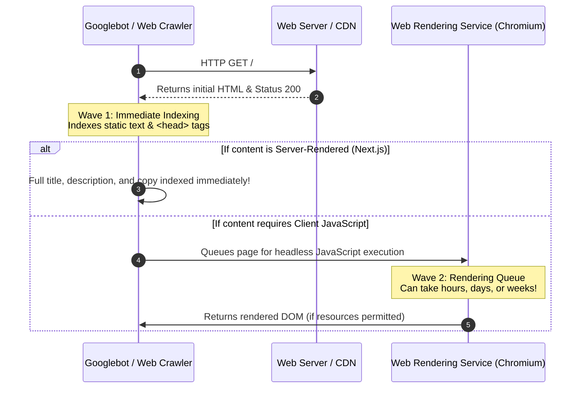
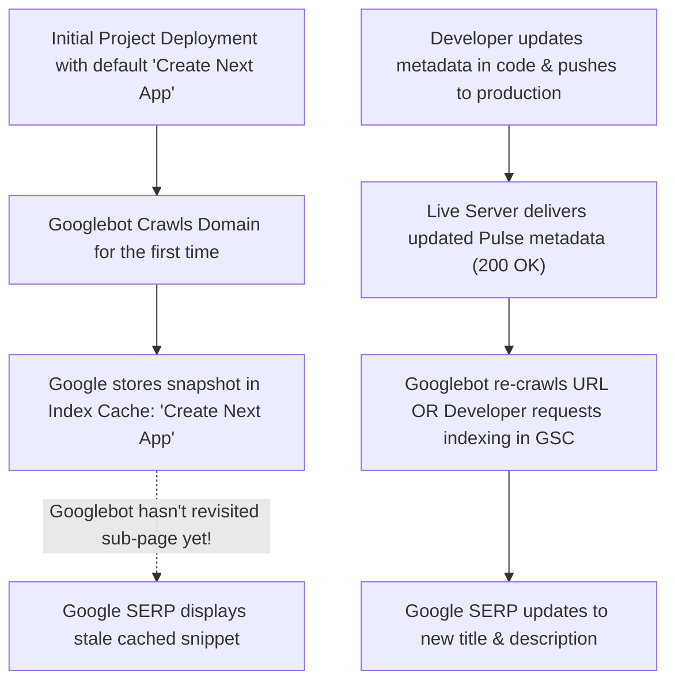
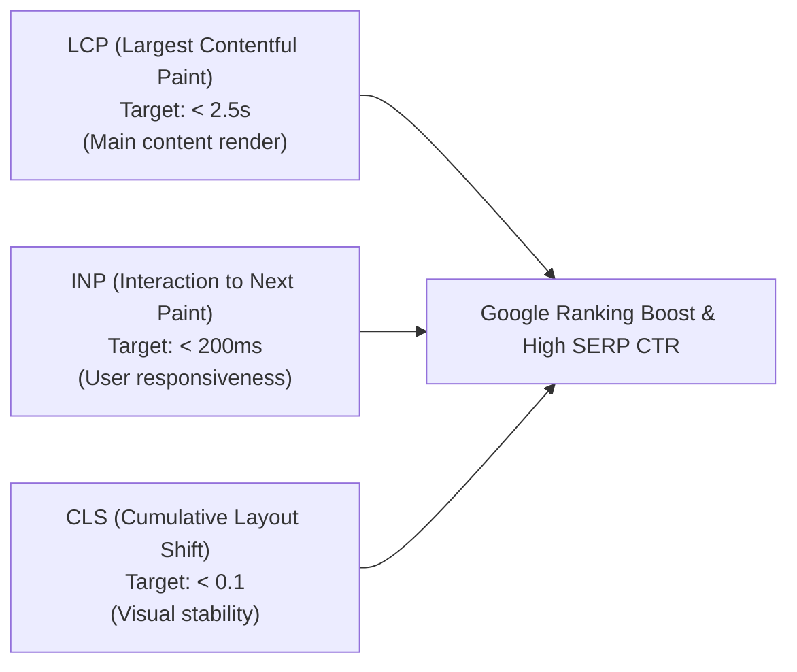
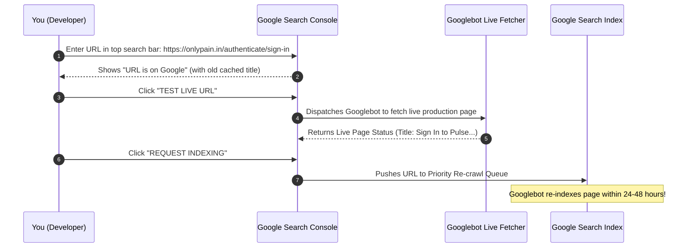

# Next.js App Router SEO Optimization — The Definitive Master Guide

A comprehensive, production-grade guide to optimizing search engine discoverability, social sharing, crawling efficiency, and technical performance in Next.js 14 & 15 App Router applications.

---

## Table of Contents

1. [Modern Web Architecture & How Search Crawlers Work](#1-modern-web-architecture--how-search-crawlers-work)
2. [The "Create Next App" Trap & Search Cache Latency](#2-the-create-next-app-trap--search-cache-latency)
3. [Next.js App Router Metadata API](#3-nextjs-app-router-metadata-api)
   - [Static Metadata (`export const metadata`)](#static-metadata)
   - [Dynamic Metadata (`export async function generateMetadata`)](#dynamic-metadata)
   - [Metadata Inheritance & Title Templates](#metadata-inheritance--title-templates)
   - [The Client Component (`'use client'`) Limitation & Solution](#the-client-component-use-client-limitation--solution)
4. [Essential Meta Tags, Canonical URLs & Social Graphs](#4-essential-meta-tags-canonical-urls--social-graphs)
   - [Title & Description Best Practices](#title--description-best-practices)
   - [Canonical URLs (`alternates.canonical`)](#canonical-urls)
   - [Open Graph (Facebook, LinkedIn, Discord)](#open-graph)
   - [Twitter / X Cards](#twitter--x-cards)
   - [Dynamic Social Image Generation (`opengraph-image.tsx`)](#dynamic-social-image-generation)
5. [Crawler Directives & Access Control (`robots.txt`)](#5-crawler-directives--access-control-robotstxt)
   - [Programmatic `app/robots.js`](#programmatic-approbotsjs)
   - [Meta Robots Tag & Private Route Protection](#meta-robots-tag--private-route-protection)
6. [Dynamic XML Sitemaps (`app/sitemap.js`)](#6-dynamic-xml-sitemaps-appsitemapjs)
   - [Generating Static & Dynamic DB Routes](#generating-static--dynamic-db-routes)
   - [Change Frequency, Priority & LastModified Signals](#change-frequency-priority--lastmodified-signals)
   - [Handling Large Sitemaps (>50,000 URLs)](#handling-large-sitemaps-50000-urls)
7. [Structured Data & Rich Snippets (Schema.org JSON-LD)](#7-structured-data--rich-snippets-schemaorg-json-ld)
   - [Why JSON-LD Generates High-CTR Rich Snippets](#why-json-ld-generates-high-ctr-rich-snippets)
   - [Safe Injection in Next.js Server Components](#safe-injection-in-nextjs-server-components)
   - [Real-World Schemas: WebSite, WebPage, Article, Person](#real-world-schemas)
8. [Clean Routing, Normalization & Redirects](#8-clean-routing-normalization--redirects)
   - [Handling Trailing Slashes & WWW vs non-WWW](#handling-trailing-slashes--www-vs-non-www)
   - [Server-Side Redirects vs Edge Middleware](#server-side-redirects-vs-edge-middleware)
9. [Core Web Vitals & Technical Performance SEO](#9-core-web-vitals--technical-performance-seo)
   - [Zero-CLS Typography with `next/font`](#zero-cls-typography-with-nextfont)
   - [Optimized Media with `next/image`](#optimized-media-with-nextimage)
   - [Streaming SSR with `React.Suspense`](#streaming-ssr-with-reactsuspense)
10. [Production Verification & Google Search Console Runbook](#10-production-verification--google-search-console-runbook)
    - [Terminal Inspection (`curl` / Node test script)](#terminal-inspection)
    - [Google Search Console URL Inspection & Live Re-crawl](#google-search-console-url-inspection--live-re-crawl)
    - [Social Card Debugging Tools](#social-card-debugging-tools)
11. [Production Reference Blueprint (Pulse Case Study)](#11-production-reference-blueprint-pulse-case-study)

---

## 1. Modern Web Architecture & How Search Crawlers Work

Search engine optimization in Single Page Applications (SPAs) has historically been plagued by client-side rendering issues. When a traditional React app runs in the browser, the server returns an almost empty HTML document:

```html
<!-- Traditional SPA empty skeleton -->
<html>
  <head><title>My App</title></head>
  <body>
    <div id="root"></div>
    <script src="/bundle.js"></script>
  </body>
</html>
```

### The Two-Wave Indexing Problem
Search engine bots (especially Googlebot) process web pages in **two waves**:



1. **Wave 1 (Instant Crawl)**: The crawler downloads the raw HTML and parses the `<head>` metadata, canonical URLs, and visible text. If your metadata relies on React running client-side, the crawler indexes whatever static string was sent from the server.
2. **Wave 2 (Deferred Render)**: If client JavaScript is detected, the crawler places the URL into a queue for the **Web Rendering Service (WRS)**. The WRS executes JavaScript in a headless browser, but this queue can lag behind by days or weeks, consumes crawl budget, and can fail if JavaScript throws runtime exceptions or times out.

### Why Next.js App Router Solves This
Next.js **React Server Components (RSC)** render HTML on the server **before sending a single byte of JavaScript** to the browser. The `<title>`, `<meta name="description">`, Open Graph tags, and structured JSON-LD schemas are baked directly into the initial HTML document. Googlebot and social platform scrapers parse 100% of your metadata during **Wave 1**, with zero delay.

---

## 2. The "Create Next App" Trap & Search Cache Latency

When bootstrapping any Next.js application using `npx create-next-app`, the default template includes:

```javascript
// Default boilerplate in src/app/layout.js
export const metadata = {
  title: "Create Next App",
  description: "Generated by create next app",
};
```

### Why Google Shows "Create Next App" Even After You Change Code

Developers frequently run into the scenario where they updated their code days ago, but Google Search still displays `Create Next App` in the Search Engine Results Page (SERP).



### Key Takeaways
- **The code is not broken**: The live production server is serving the correct tags, but Google serves search results from its **local index cache**, which updates on its own crawling schedule.
- **Homepages vs. Sub-routes**: Google crawls root domains (`https://example.com/`) frequently (daily or weekly), but deep sub-routes (`/authenticate/sign-in`) with low sitemap priority can sit in the index cache untouched for weeks unless actively refreshed.
- **Action Required**: Raising sitemap priority, adding clean canonicals, and using **Google Search Console URL Inspection** triggers an immediate re-fetch.

---

## 3. Next.js App Router Metadata API

Next.js App Router provides a first-class, type-safe Metadata API. You declare metadata either statically via the `metadata` object or dynamically via `generateMetadata()`.

### Static Metadata

Use the static `metadata` export when the page information is known at build time:

```javascript
// src/app/about/page.js
export const metadata = {
  title: "About Us — Discover Our Mission & Team",
  description: "Learn about the creators, engineers, and vision behind Pulse.",
  alternates: {
    canonical: "https://onlypain.in/about",
  },
  openGraph: {
    title: "About Us — Pulse",
    description: "Learn about the creators, engineers, and vision behind Pulse.",
    url: "https://onlypain.in/about",
    siteName: "Pulse",
    type: "website",
  },
};

export default function AboutPage() {
  return <main><h1>About Pulse</h1></main>;
}
```

---

### Dynamic Metadata

For pages that depend on dynamic route parameters (e.g. `[blog-id]`, `[username]`) or external API calls, export an `async function generateMetadata()`:

```javascript
// src/app/blogs/[blog-id]/page.js
import { connectToDB } from "@/database";
import { Blog } from "@/models";

export async function generateMetadata({ params, searchParams }, parent) {
  const { "blog-id": blogId } = await params;

  try {
    await connectToDB();
    const blog = await Blog.findById(blogId).lean();

    if (!blog) {
      return {
        title: "Story Not Found",
        description: "The requested story could not be located on Pulse.",
        robots: { index: false, follow: false },
      };
    }

    // Strip HTML formatting for pure text snippet
    const cleanExcerpt = blog.description
      ? blog.description.replace(/<[^>]*>?/gm, "").slice(0, 160)
      : "Read this story on Pulse.";

    const canonicalUrl = `https://onlypain.in/blogs/${blogId}`;

    return {
      title: `${blog.title} — Pulse`,
      description: cleanExcerpt,
      authors: [{ name: blog.authorName || "Pulse Creator" }],
      alternates: {
        canonical: canonicalUrl,
      },
      openGraph: {
        title: blog.title,
        description: cleanExcerpt,
        url: canonicalUrl,
        type: "article",
        publishedTime: blog.date,
        authors: [blog.authorName],
        images: blog.image ? [{ url: blog.image, alt: blog.title }] : [],
      },
      twitter: {
        card: "summary_large_image",
        title: blog.title,
        description: cleanExcerpt,
        images: blog.image ? [blog.image] : [],
      },
    };
  } catch (error) {
    return {
      title: "Pulse Story",
      description: "Read inspiring creator stories on Pulse.",
    };
  }
}

export default async function BlogPostPage({ params }) {
  // Page rendering logic...
}
```

> [!TIP]
> **Fetch Deduplication**: Next.js automatically deduplicates `fetch` requests between `generateMetadata()` and the page component itself. If both call `fetch('/api/post/1')`, the network request runs only once.

---

### Metadata Inheritance & Title Templates

Next.js automatically merges metadata from the root layout down through nested layouts and pages.

Define a **Title Template** in the root layout (`src/app/layout.js`):

```javascript
// src/app/layout.js
export const metadata = {
  metadataBase: new URL("https://onlypain.in"),
  title: {
    default: "Pulse — Social Content & Creator Network",
    template: "%s | Pulse", // '%s' will be replaced by child titles
  },
  description: "Next-generation decentralized publishing and live networking.",
};
```

When a child page defines:
```javascript
export const metadata = {
  title: "Explore Stories",
};
```
The resulting rendered browser `<title>` will automatically be:
```html
<title>Explore Stories | Pulse</title>
```

---

### The Client Component (`'use client'`) Limitation & Solution

> [!CAUTION]
> **Next.js Rule**: You **CANNOT** export `metadata` or `generateMetadata` from a file marked with `"use client"`.
> Doing so throws a compilation error:
> `Error: You are attempting to export "metadata" from a component marked with "use client", which is not supported.`

Many pages require client-side interactivity (state, form inputs, React hooks like `useState` or `useRouter`). For instance, an authentication page (`/authenticate/sign-in`) must manage forms and event listeners.

#### The Architectural Solution: Route-Level Server `layout.js` Wrapper

Create a **Server Component `layout.js`** inside the route folder to host the metadata, and leave the `page.js` as a `"use client"` component:

```
src/app/authenticate/sign-in/
├── layout.js   <-- SERVER COMPONENT: exports metadata & JSON-LD schema
└── page.js     <-- CLIENT COMPONENT: 'use client', handles state & UI
```

```javascript
// src/app/authenticate/sign-in/layout.js  (Server Component)
export const metadata = {
  title: "Sign In to Pulse — Access Your Creator Feed & Network",
  description:
    "Sign in to your Pulse account on onlypain.in. Follow creators and engage in real-time WebRTC live calls.",
  alternates: {
    canonical: "https://onlypain.in/authenticate/sign-in",
  },
  openGraph: {
    title: "Sign In to Pulse — Social Content & Creator Network",
    description: "Sign in to curate your feed and connect live on onlypain.in.",
    url: "https://onlypain.in/authenticate/sign-in",
    siteName: "Pulse",
    type: "website",
  },
};

export default function SignInLayout({ children }) {
  return children;
}
```

```javascript
// src/app/authenticate/sign-in/page.js  (Client Component)
"use client";

import { useState } from "react";
// Interactive form handling...
export default function SignInPage() {
  const [email, setEmail] = useState("");
  return <form>...</form>;
}
```

---

## 4. Essential Meta Tags, Canonical URLs & Social Graphs

### Title & Description Best Practices

| Tag | Optimal Length | Best Practice | Common Mistake |
| :--- | :--- | :--- | :--- |
| **`<title>`** | 50 – 60 characters | Include primary keyword + brand name. Put primary keyword near the beginning. | Keyword stuffing or leaving default "Create Next App". |
| **`description`** | 140 – 160 characters | High-converting summary with a clear call-to-action (CTA). | Over 160 characters (gets truncated with `...` in Google SERP). |

---

### Canonical URLs

A canonical tag informs search engines of the authoritative URL for a page, preventing duplicate content penalties caused by query parameters, tracking tags (`?utm_source=...`), or multiple paths serving identical content:

```javascript
alternates: {
  canonical: "https://onlypain.in/authenticate/sign-in",
}
```

> [!WARNING]
> **The Inherited Canonical Bug**: If you define `canonical: "https://example.com/authenticate/sign-in"` in a parent `app/authenticate/layout.js`, every child route (`/authenticate/sign-up`, `/authenticate/forgot-password`) will inherit that canonical unless explicitly overridden! Google will treat sign-up and password reset as duplicate copies of sign-in. Always specify route-specific canonicals in the child layouts.

---

### Open Graph

Open Graph (OG) protocol controls how links appear when shared on platforms like Facebook, WhatsApp, LinkedIn, Discord, and Slack:

```javascript
openGraph: {
  title: "Pulse — Social Content & Creator Network",
  description: "Discover inspiring stories and connect in real-time.",
  url: "https://onlypain.in",
  siteName: "Pulse",
  images: [
    {
      url: "https://onlypain.in/og-image.png",
      width: 1200,
      height: 630,
      alt: "Pulse Platform Preview",
    },
  ],
  locale: "en_US",
  type: "website", // or "article" for blog posts
}
```

---

### Twitter / X Cards

Twitter uses its own proprietary meta tags:

```javascript
twitter: {
  card: "summary_large_image", // or "summary" for compact square preview
  title: "Pulse — Social Content & Creator Network",
  description: "Discover inspiring stories and connect in real-time.",
  creator: "@pulse_official",
  images: ["https://onlypain.in/twitter-card.png"],
}
```

---

### Dynamic Social Image Generation (`opengraph-image.tsx`)

Next.js allows you to dynamically generate Open Graph images on-the-fly using JSX and CSS via the `ImageResponse` constructor:

```javascript
// src/app/blogs/[blog-id]/opengraph-image.js
import { ImageResponse } from "next/og";
import { connectToDB } from "@/database";
import { Blog } from "@/models";

export const runtime = "edge";
export const alt = "Story Cover";
export const size = { width: 1200, height: 630 };
export const contentType = "image/png";

export default async function Image({ params }) {
  const { "blog-id": blogId } = await params;
  await connectToDB();
  const blog = await Blog.findById(blogId).lean();

  return new ImageResponse(
    (
      <div
        style={{
          background: "linear-gradient(to bottom right, #090d16, #111827)",
          width: "100%",
          height: "100%",
          display: "flex",
          flexDirection: "column",
          justifyContent: "space-between",
          padding: 60,
          color: "white",
        }}
      >
        <span style={{ fontSize: 28, color: "#a855f7" }}>Pulse Story</span>
        <h1 style={{ fontSize: 64, fontWeight: "bold", lineHeight: 1.2 }}>
          {blog?.title || "Discover on Pulse"}
        </h1>
        <p style={{ fontSize: 24, color: "#9ca3af" }}>
          By {blog?.authorName || "Pulse Creator"} · onlypain.in
        </p>
      </div>
    ),
    { ...size }
  );
}
```

---

## 5. Crawler Directives & Access Control (`robots.txt`)

Search engines respect `robots.txt` as the first instruction manual before crawling any page on your domain.

### Programmatic `app/robots.js`

In Next.js App Router, create a `src/app/robots.js` file. Next.js serves this automatically at `https://yourdomain.com/robots.txt`:

```javascript
// src/app/robots.js
export default function robots() {
  return {
    rules: [
      {
        userAgent: "*",
        allow: "/",
        disallow: [
          "/api/",               // Internal API endpoints
          "/creator-dashboard/", // Protected creator dashboard
          "/settings/",          // Account settings
          "/history/",           // Private reading history
          "/messages/",          // Private direct messages
        ],
      },
    ],
    sitemap: "https://onlypain.in/sitemap.xml",
    host: "https://onlypain.in",
  };
}
```

---

### Meta Robots Tag & Private Route Protection

Even if a page is excluded in `robots.txt`, search engines might still index its URL if external sites link to it. To guarantee search engines do not index sensitive or utility pages (such as password reset), set the `robots` meta directive directly on that route:

```javascript
// src/app/authenticate/forgot-passward/layout.js
export const metadata = {
  title: "Reset Password — Pulse Account Recovery",
  robots: {
    index: false, // Tells Googlebot: DO NOT INDEX THIS PAGE
    follow: true, // Tells Googlebot: Follow valid outbound links
  },
};
```

---

## 6. Dynamic XML Sitemaps (`app/sitemap.js`)

An XML sitemap lists every indexable URL on your site, informing search engines about content freshness and relative importance.

### Generating Static & Dynamic DB Routes

Create `src/app/sitemap.js`. Next.js serves this automatically at `https://yourdomain.com/sitemap.xml`:

```javascript
// src/app/sitemap.js
import { connectToDB } from "@/database";
import { Blog, User } from "@/models";

export default async function sitemap() {
  const baseUrl = "https://onlypain.in";

  // 1. Core Static Pages
  const staticRoutes = [
    {
      url: baseUrl,
      lastModified: new Date(),
      changeFrequency: "hourly",
      priority: 1.0,
    },
    {
      url: `${baseUrl}/search`,
      lastModified: new Date(),
      changeFrequency: "daily",
      priority: 0.8,
    },
    {
      url: `${baseUrl}/authenticate/sign-in`,
      lastModified: new Date(),
      changeFrequency: "weekly",
      priority: 0.7,
    },
    {
      url: `${baseUrl}/authenticate/sign-up`,
      lastModified: new Date(),
      changeFrequency: "weekly",
      priority: 0.7,
    },
  ];

  // 2. Dynamic Content from Database
  let dynamicBlogRoutes = [];
  let dynamicProfileRoutes = [];

  try {
    await connectToDB();

    // Fetch published stories
    const blogs = await Blog.find({}, { _id: 1, date: 1 })
      .sort({ date: -1 })
      .limit(500)
      .lean();

    if (Array.isArray(blogs)) {
      dynamicBlogRoutes = blogs.map((b) => ({
        url: `${baseUrl}/blogs/${b._id}`,
        lastModified: b.date || new Date(),
        changeFrequency: "weekly",
        priority: 0.9,
      }));
    }

    // Fetch public creator profiles
    const users = await User.find({}, { username: 1, updatedAt: 1 })
      .limit(200)
      .lean();

    if (Array.isArray(users)) {
      dynamicProfileRoutes = users
        .filter((u) => u.username)
        .map((u) => ({
          url: `${baseUrl}/profile/${u.username}`,
          lastModified: u.updatedAt || new Date(),
          changeFrequency: "weekly",
          priority: 0.7,
        }));
    }
  } catch (err) {
    console.error("Error generating dynamic sitemap routes:", err);
  }

  return [...staticRoutes, ...dynamicBlogRoutes, ...dynamicProfileRoutes];
}
```

### Change Frequency, Priority & LastModified Signals

- **`lastModified`**: ISO date or JavaScript `Date`. Critical for telling crawlers whether the content was actually updated since the last crawl.
- **`changeFrequency`**: Hints how often the content changes (`always`, `hourly`, `daily`, `weekly`, `monthly`, `yearly`, `never`).
- **`priority`**: Value between `0.0` and `1.0` indicating priority relative to other URLs on your own site (e.g. Home = `1.0`, Blog Posts = `0.9`, Auth = `0.7`, Terms = `0.3`).

---

### Handling Large Sitemaps (>50,000 URLs)

Google limits a single sitemap file to **50,000 URLs** or **50MB**. If your application scales past this, use `generateSitemaps`:

```javascript
// src/app/sitemap.js
export async function generateSitemaps() {
  // Return an array of IDs, e.g. [{ id: 0 }, { id: 1 }, { id: 2 }]
  const totalPosts = await getPostCount();
  const sitemapsCount = Math.ceil(totalPosts / 10000);
  return Array.from({ length: sitemapsCount }, (_, i) => ({ id: i }));
}

export default async function sitemap({ id }) {
  // Fetch slice for id
  const start = id * 10000;
  const posts = await getPosts(start, 10000);
  return posts.map(post => ({
    url: `https://onlypain.in/blogs/${post.id}`,
    lastModified: post.updatedAt,
  }));
}
```

---

## 7. Structured Data & Rich Snippets (Schema.org JSON-LD)

Structured Data provides explicit clues about the meaning of a page to Googlebot, enabling **Rich Snippets** in Google SERP:
- Article headlines with author avatars
- Sitelinks search boxes
- Star ratings and reviews
- Breadcrumb navigation bars

```
┌─────────────────────────────────────────────────────────────┐
│  https://onlypain.in › blogs › 673abc                       │
│  The Future of Web3 Publishing — Pulse                      │
│  ⭐⭐⭐⭐⭐ Rating: 4.9 · By @saptavi · Published Sep 2026   │
│  Explore how decentralized protocols and WebRTC are...       │
└─────────────────────────────────────────────────────────────┘
```

### Safe Injection in Next.js Server Components

Inject JSON-LD schemas safely into the HTML `<head>` or body by serializing a plain JavaScript object:

```javascript
export default function BlogPostLayout({ children }) {
  const jsonLd = {
    "@context": "https://schema.org",
    "@type": "BlogPosting",
    "headline": "The Future of Web3 Publishing",
    "image": "https://onlypain.in/cover.jpg",
    "datePublished": "2026-09-15T08:00:00+00:00",
    "author": {
      "@type": "Person",
      "name": "Saptarshi",
      "url": "https://onlypain.in/profile/saptavi"
    },
    "publisher": {
      "@type": "Organization",
      "name": "Pulse",
      "logo": {
        "@type": "ImageObject",
        "url": "https://onlypain.in/logo.png"
      }
    }
  };

  return (
    <>
      <script
        type="application/ld+json"
        dangerouslySetInnerHTML={{ __html: JSON.stringify(jsonLd) }}
      />
      {children}
    </>
  );
}
```

---

## 8. Clean Routing, Normalization & Redirects

Search engines consider `https://example.com/blog`, `https://example.com/blog/`, and `https://www.example.com/blog` as separate URLs. Having all three active dilutes PageRank and causes duplicate content flags.

### 1. Canonical Redirect in Next.js Configuration

Enforce trailing slash behavior in `next.config.mjs`:

```javascript
// next.config.mjs
/** @type {import('next').NextConfig} */
const nextConfig = {
  trailingSlash: false, // Forces all URLs without trailing slashes
};

export default nextConfig;
```

### 2. Route Redirection for Empty Directory Paths

If you have a nested folder like `/authenticate` with children `/authenticate/sign-in` and `/authenticate/sign-up`, visiting `/authenticate` directly could display an empty or half-rendered page.

Always redirect cleanly with Next.js `redirect()`:

```javascript
// src/app/authenticate/page.js
import { redirect } from "next/navigation";

export default function AuthenticatePage() {
  redirect("/authenticate/sign-in");
}
```

---

## 9. Core Web Vitals & Technical Performance SEO

Google utilizes **Core Web Vitals** as a direct ranking factor. Fast pages rank higher and have lower bounce rates.



### 1. Zero-CLS Typography with `next/font`

Browser font swapping (`FOUT` or `FOIT`) shifts text layout, causing high Cumulative Layout Shift (CLS). `next/font` downloads the font at build time, hosts it locally, and automatically injects size-adjust metrics to prevent layout shifts:

```javascript
// src/app/layout.js
import { Geist, Geist_Mono } from "next/font/google";

const geistSans = Geist({
  variable: "--font-geist-sans",
  subsets: ["latin"],
  display: "swap", // Immediate text render with zero shift
});
```

### 2. High-Performance Media with `next/image`

Always use Next.js `<Image>` for above-the-fold banners and cover images:
- Automatically converts formats to modern **WebP** or **AVIF**.
- Uses responsive `srcset` tailored to device resolution.
- Adds `priority` to the Largest Contentful Paint (LCP) element to disable lazy loading:

```javascript
import Image from "next/image";

export function HeroBanner() {
  return (
    <Image
      src="/hero-banner.webp"
      alt="Pulse creator community"
      width={1200}
      height={600}
      priority // Prevents LCP delays by preloading immediately
      className="w-full rounded-2xl object-cover"
    />
  );
}
```

---

## 10. Production Verification & Google Search Console Runbook

### Terminal Inspection

Always test what the live server sends to crawlers using `curl` or a Node script to inspect the server-rendered HTML:

```bash
# Check HTTP status headers
curl -sI https://onlypain.in/authenticate/sign-in

# Check raw title tag in returned HTML
curl -s https://onlypain.in/authenticate/sign-in | grep -o "<title>[^<]*</title>"

# Check robots meta directive
curl -s https://onlypain.in/authenticate/sign-in | grep -o '<meta name="robots"[^>]*>'
```

---

### Google Search Console URL Inspection & Live Re-crawl

When Google shows a cached snippet like `"Create Next App"`:



1. Open **[Google Search Console](https://search.google.com/search-console)**.
2. In the top inspection bar, paste the URL:
   ```text
   https://onlypain.in/authenticate/sign-in
   ```
3. Click **"Test Live URL"**. Verify that Googlebot receives a **200 OK** and that the live HTML shows your custom title and description.
4. Click **"Request Indexing"**. This places the URL into Google's priority crawl queue, refreshing the SERP snippet within 24–48 hours instead of waiting weeks for natural re-crawl.
5. Repeat for any other key routes (e.g., `/authenticate/sign-up`).

---

### Social Card Debugging Tools

Before posting your links on social platforms, use their official debug tools to clear their cached link previews:
- **Facebook / Messenger / Instagram**: [Facebook Sharing Debugger](https://developers.facebook.com/tools/debug/) (Click *"Scrape Again"*).
- **LinkedIn**: [LinkedIn Post Inspector](https://www.linkedin.com/post-inspector/).
- **Twitter / X**: [Twitter Card Validator](https://cards-dev.twitter.com/validator).

---

## 11. Production Reference Blueprint (Pulse Case Study)

Here is how the complete SEO architecture is structured across Pulse (`onlypain.in`):

```
src/app/
├── layout.js                     <-- Root metadata, title template, fonts, global OG
├── robots.js                     <-- Disallow /api, /settings, /dashboard, links to sitemap
├── sitemap.js                    <-- Static routes + dynamic Mongoose queries (blogs, users)
├── page.js                       <-- Root home feed (high priority, hourly crawl)
├── search/page.js                <-- Search discovery page
├── blogs/[blog-id]/
│   ├── page.js                   <-- Dynamic generateMetadata() fetching title, excerpt, OG
│   └── opengraph-image.js        <-- Dynamic 1200x630 social preview card generator
└── authenticate/
    ├── layout.js                 <-- Base auth layout
    ├── page.js                   <-- Auto-redirects to /authenticate/sign-in
    ├── sign-in/
    │   ├── layout.js             <-- Server layout: "Sign In to Pulse", JSON-LD schema
    │   └── page.js               <-- Client component: login form
    ├── sign-up/
    │   ├── layout.js             <-- Server layout: "Create an Account", JSON-LD schema
    │   └── page.js               <-- Client component: registration form
    └── forgot-passward/
        ├── layout.js             <-- Server layout: noindex, follow utility protection
        └── page.js               <-- Client component: OTP recovery form
```

### Summary Checklist for Any New Next.js Route

- [ ] Does this route have a distinct, descriptive `<title>` (50–60 characters)?
- [ ] Does it have a persuasive `description` (140–160 characters) with a CTA?
- [ ] Does it define an explicit `alternates.canonical` URL?
- [ ] If it is a `"use client"` page, is the metadata exported from a co-located Server `layout.js`?
- [ ] Are sensitive or utility routes (passwords, admin panels) protected with `robots: { index: false }`?
- [ ] Is the route included in `sitemap.js` with appropriate `changeFrequency` and `priority`?
- [ ] Has the URL been validated using `npm run build` and tested in Google Search Console?
